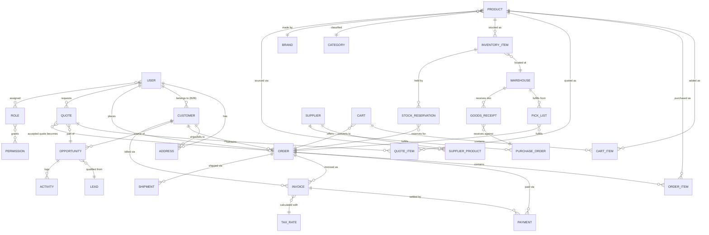
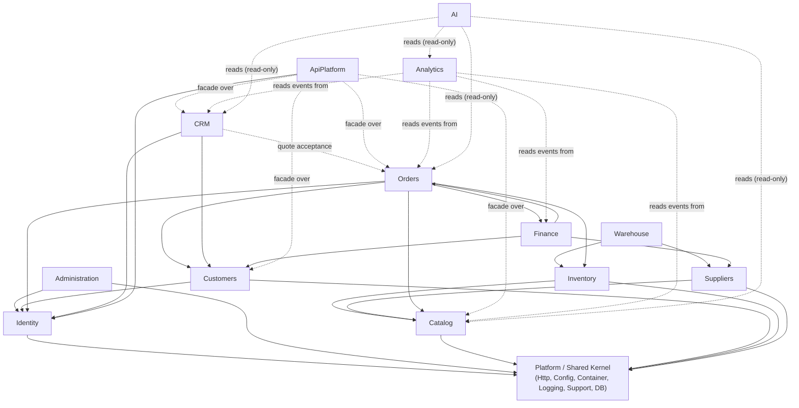

# Domain Architecture Blueprint — SA Business Distribution

**Phase:** 4 — Digital Commerce Core Platform (Blueprint)
**Date:** 21 July 2026
**Status:** Awaiting approval. No feature code is included in this phase — this document is the enterprise blueprint every future module will follow. Implementation begins with Identity and Administration only after this blueprint is approved.

---

## 0. Validation of previous work

Before drafting this blueprint, the current repository state was re-verified rather than assumed:

- `git status` is clean and `git log` shows the expected four phases (`Phase 2: Enterprise foundation recovery`, `Phase 3: Enterprise architecture modernization`, plus their reports) with no drift since the last commit (`f7f5584`).
- `php -l` across every file in `src/`, `views/`, `components/`, and `public/` is clean — no syntax errors have crept in.
- The full `src/` inventory was re-enumerated directly from disk (not from memory of Phase 3): 8 Models, 4 Repositories, 5 Services, 7 Controllers, plus the `Http`, `Config`, `Container`, `Logging`, `Support`, `Database` platform layer — all namespaced under `App\`, PSR-4 autoloaded, matching the Architecture Modernization Report.
- The real committed database schema (`database/*.sql`) was re-read directly rather than assumed, to ground this blueprint's entity model in what actually exists: `users`, `roles`, `permissions`, `role_permissions`, `user_roles`, `addresses`, `login_attempts`, `password_resets`, `remember_tokens`, `email_verifications`, `products`, `categories`, `brands`, `product_images`, `cart`, `cart_items`, `quotes`, `quote_items`.

Conclusion: Phase 2 and Phase 3 are intact and this is a sound foundation to design Phase 4 against. Section 1 below maps every one of those existing classes and tables onto the 13 requested business domains.

---

## 1. Domain Architecture

The current codebase is organized by **technical layer** (`src/Models/*`, `src/Services/*`, `src/Controllers/*` each holding every feature mixed together). Phase 4 reorganizes around **business domains** — each domain owns its own models, repositories, services, and controllers, and exposes a deliberately narrow interface to every other domain. This is a direct application of Domain-Driven Design's bounded-context principle: a "Product" means something different to Catalog (a sellable thing with attributes) than it does to Inventory (a stock-keeping unit at a location) or Finance (a revenue line with a tax class) — conflating them, as the current flat `products` table partially does, is exactly what causes the kind of coupling that made Phase 1's entry-point breakage possible in the first place.

For each of the 13 requested domains: its purpose, the bounded context it owns, its core entities, and — critically — what already exists today versus what's net-new.

### 1.1 Identity
**Owns:** authentication, authorization, sessions, credentials, roles/permissions. Answers "who is this actor and what are they allowed to do" — nothing about *why* they're doing it or their business relationship to the company (that's Customers/CRM).
**Existing:** `Models\User`, `Role`, `Permission`; `UserRepository`; `AuthService` (register/login/logout/password handling); `AuthController`; the `users`, `roles`, `permissions`, `role_permissions`, `user_roles`, `login_attempts`, `password_resets`, `remember_tokens`, `email_verifications` tables; CSRF handling in `Kernel::bootSession()`.
**Net-new for Phase 4:** a clean split between **staff/internal identities** (admin portal, sales reps, warehouse operators) and **customer identities** (storefront shoppers) — today's single `users` table conflates both. API credentials (tokens/API keys) for the future API Platform domain. Multi-factor authentication. This is the first domain to implement, per your instruction, precisely because every other domain depends on it.

### 1.2 Administration
**Owns:** system configuration, feature flags, audit logging, admin-user management, module enablement. The "control plane" for the whole platform.
**Existing:** essentially nothing — `Config` class + `config/app.php` is a primitive precursor (static config loading only, no runtime-editable settings, no audit trail). The original audit confirmed no admin portal exists.
**Net-new:** `AdminUser` (or a role-flagged `Identity\User`), `AuditLogEntry`, `SystemSetting` (runtime-editable, DB-backed, replacing the static config file for anything that should change without a deploy), `FeatureFlag`. Second domain to implement, per your instruction — every subsequent domain needs a place to register its settings and be audited.

### 1.3 Catalog / PIM
**Owns:** product information — what can be sold, its attributes, categorization, media, and pricing rules (not stock levels — that's Inventory).
**Existing:** `Models\Product`; `ProductRepository`; `ProductService`; `ProductController`; `products`, `categories`, `brands`, `product_images` tables. This is the most mature existing domain.
**Net-new:** attribute sets / EAV or JSON-attribute model (today's `products` table is flat — no configurable attributes), product variants (size/color/config), B2B tiered pricing, product bundles, tax classes. **Note:** `products.stock` currently lives on the Catalog table — Phase 4 deliberately separates this into the Inventory domain (see 1.4); Catalog will own `default price` and `sellable` status, not on-hand quantity.

### 1.4 Inventory
**Owns:** stock levels, reservations, adjustments, multi-location quantity — the operational question "how many do we have, and where."
**Existing:** nothing as a distinct domain. The current `products.stock` integer is a single flat count with no location, no reservation concept, and no audit trail — adequate for a single-warehouse MVP, inadequate for the multi-location goal in your standing project instructions.
**Net-new:** `InventoryItem` (product × location × quantity), `StockReservation` (holds stock against an open order before fulfillment), `StockAdjustment` (manual corrections with reason codes), `StockMovement` (audit trail), low-stock thresholds/alerts.

### 1.5 Warehouse
**Owns:** the physical execution of inventory movement — receiving, picking, packing, shipping, transfers between locations. Inventory answers "how many/where"; Warehouse answers "who does what, physically, to make that number change."
**Existing:** nothing.
**Net-new:** `Warehouse`, `Zone`, `Bin`, `PickList`, `PackingSlip`, `GoodsReceipt` (inbound from Suppliers), `StockTransfer` (inter-warehouse), `Shipment` (outbound, feeds Orders' fulfillment status).

### 1.6 Orders
**Owns:** the checkout and order lifecycle — cart, order placement, payment orchestration, fulfillment status, returns/RMA. This is the single largest gap in the current codebase.
**Existing:** `Models\CartItem`; `CartRepository`; `CartService`; `CartController` — but **there is no `Order` entity anywhere in the system**. The current app can add items to a cart and submit a quote request, but has no checkout flow, no order confirmation, no payment integration, and no fulfillment tracking. This was flagged as a scope gap in the original Phase 1 audit and remains unaddressed by design (Phases 2–3 explicitly preserved, not extended, business logic).
**Net-new:** `Order`, `OrderItem`, `OrderStatusHistory`, `Payment` (orchestration record — actual payment processing is a third-party gateway integration), `Return`/`RMA`. Cart is reclassified into this domain (see Section 5) since a cart is simply an order's pre-checkout state.

### 1.7 Customers
**Owns:** the business relationship and profile data — who the customer is as an account, not how they log in (Identity) or what they've bought (Orders). Distinct from Identity deliberately: a B2B account may have multiple `Identity\User` logins under one `Customer` company account.
**Existing:** `Models\Address`; `company_name` currently lives directly on the `users` table, conflating Identity and Customer concerns.
**Net-new:** `Customer` (the business entity — currently absent; today "customer" and "user" are the same row), `CustomerAddress` (`Address` model is already close to this shape), B2B account hierarchy (parent company + sub-accounts/buyers), `CustomerSegment`, credit terms. Wishlist (`WishlistController`, currently session-only) belongs here as a customer engagement feature.

### 1.8 Suppliers
**Owns:** the supplier directory, procurement, purchase orders, supplier-side product/cost data.
**Existing:** nothing.
**Net-new:** `Supplier`, `SupplierProduct` (links a supplier to a Catalog SKU plus cost price and lead time), `PurchaseOrder`, `PurchaseOrderItem`, `SupplierContact`. Feeds Warehouse (goods receipt) and Finance (accounts payable).

### 1.9 CRM
**Owns:** the sales pipeline — leads, opportunities, interactions/activity history, and (this is the key domain-boundary decision in this blueprint) the **existing Quote/RFQ system**.
**Existing:** `Models\Quote`, `QuoteItem`; `QuoteRepository`; `QuoteService`; `QuoteController`. Phase 3's own report already flagged that this domain has two inconsistent implementations — a session-only capture (`quote-request.php` → `sessionRequest()`) and a DB-backed flow (`quote-api.php` → `api()`) that don't share state. That inconsistency is a CRM-domain problem to resolve, not a technical one.
**Net-new:** `Lead`, `Opportunity`, `Activity`/interaction log, `Contact` (distinct from `Identity\User` — a CRM contact may not have a login at all). **Domain boundary decision:** a Quote is a CRM artifact through its whole negotiation lifecycle; the moment a customer accepts it, it hands off and becomes an `Orders\Order` — CRM should not own post-acceptance fulfillment state, and Orders should not own pre-acceptance negotiation state.

### 1.10 Finance
**Owns:** invoicing, payments, tax/VAT, credit notes, and the accounting-system integration boundary.
**Existing:** VAT calculation logic currently lives inside `QuoteService` (the R24,999 → R28,748.85 at 15% VAT math verified in Phase 2). That's the only Finance-domain logic that exists today, and it's presently embedded in CRM rather than owned by Finance.
**Net-new:** `Invoice`, `Payment`, `TaxRate`/`TaxClass` (extracted from `QuoteService` into a proper, reusable Finance service so Orders can use the same VAT logic instead of duplicating it), `CreditNote`, a defined integration boundary for future ERP/accounting-system sync (per your standing instructions' "ERP Integration" goal).

### 1.11 Analytics
**Owns:** cross-domain reporting, dashboards, KPIs. Deliberately a **read-only consumer** of every other domain — Analytics should never be a system of record for anything, only a system of insight.
**Existing:** `ProductService::trackProductView()` / `getRecentlyViewedProducts()` is a small precursor — a per-session behavioral signal, not real analytics infrastructure.
**Net-new:** an event log / analytics event store (append-only, fed by domain events from Orders, CRM, Catalog, etc.), report definitions, dashboard/widget configuration, materialized aggregate tables for performance. Should be built against events emitted by other domains, not by querying their tables directly (see Section 3 on dependency direction).

### 1.12 AI
**Owns:** the AI Customer Assistant, product recommendations, AI search, document processing, and the future AI Operations/Developer Assistant modules from your standing instructions.
**Existing:** nothing.
**Net-new:** a provider-agnostic AI service abstraction (so the platform isn't locked to one model vendor), a recommendation engine (initially consuming Catalog + Analytics behavioral data), search index integration, a conversation/session log, and — importantly — a **pluggable, read-only integration pattern** into Catalog/Orders/CRM rather than direct coupling, so AI features can evolve independently and can't destabilize core commerce flows if a provider has an outage.

### 1.13 API Platform
**Owns:** the external/partner-facing API surface, developer portal, API keys, rate limiting, webhooks, versioning.
**Existing:** `cart-api.php` and `quote-api.php` are *internal* AJAX endpoints — no authentication token scheme, no versioning, no documentation, and (a real inconsistency worth flagging) **different, ad hoc JSON response shapes** between the two (`{"success":true,...}` vs `{"error":...,"detail":...}` isn't even consistent between success and failure paths on the same endpoint). These are not a foundation to build a real API Platform on directly — they're internal implementation detail that the API Platform domain will eventually front with a proper, versioned, authenticated, consistently-enveloped public API.
**Net-new:** `ApiClient`/`ApiKey`, `WebhookSubscription`, rate-limit policy, `/api/v1/...` versioned routes, OpenAPI spec. Last domain to implement — it's a façade over the other domains, so it needs them to have stable contracts first.

---

## 2. Entity Relationship Model

### 2.1 Cross-domain aggregate map

This shows only aggregate roots (not every field) and the relationships that cross domain boundaries — the shape that matters most for dependency management.



### 2.2 Existing entities — full field detail (from committed schema)

**Identity:** `users(id, first_name, last_name, company_name, email, phone, password_hash, is_active, is_verified, notifications_marketing, notifications_updates, last_login_at, created_at, updated_at)`, `roles(id, name)`, `permissions`, `role_permissions`, `user_roles` (join tables), `login_attempts`, `password_resets`, `remember_tokens`, `email_verifications`.
*Note:* `company_name` sitting on `users` is exactly the Identity/Customers conflation flagged in 1.7 — Phase 4's Identity work should migrate this column to the new `Customer` entity.

**Catalog:** `products(id, sku, name, slug, short_description, description, category_id, brand_id, price, sale_price, stock, is_featured, is_new, is_on_sale, is_active, created_at, updated_at)`, `categories`, `brands`, `product_images(id, product_id, file_name, ...)`.
*Note:* `stock` sitting on `products` is exactly the Catalog/Inventory conflation flagged in 1.4.

**Orders (pre-checkout only today):** `cart`, `cart_items` — session/user-scoped, no relationship to any order because no `orders` table exists yet.

**CRM:** `quotes(id, quote_number, session_id, status, company_name, contact_name, email, phone, registration_number, vat_number, notes, subtotal, vat_amount, grand_total, created_at, updated_at)`, `quote_items`.

**Customers:** `addresses` (currently attached directly to `users`, will re-parent to the new `Customer` entity).

### 2.3 Net-new entities — planning-level field lists

| Domain | Entity | Key fields (indicative, not final DDL) |
|---|---|---|
| Administration | `AuditLogEntry` | actor_user_id, action, entity_type, entity_id, before, after, created_at |
| Administration | `SystemSetting` | key, value, type, is_editable, updated_by, updated_at |
| Administration | `FeatureFlag` | key, is_enabled, rollout_rules |
| Inventory | `InventoryItem` | product_id, warehouse_id, quantity_on_hand, quantity_reserved, reorder_threshold |
| Inventory | `StockReservation` | inventory_item_id, order_id, quantity, expires_at |
| Inventory | `StockMovement` | inventory_item_id, delta, reason, reference_type, reference_id, created_at |
| Warehouse | `Warehouse` | name, code, address_id, is_active |
| Warehouse | `PickList` / `PackingSlip` / `GoodsReceipt` / `Shipment` | order_id / purchase_order_id, status, items, timestamps |
| Orders | `Order` | order_number, customer_id, user_id, status, subtotal, tax_total, grand_total, placed_at |
| Orders | `OrderItem` | order_id, product_id, sku, quantity, unit_price, line_total |
| Orders | `Payment` | order_id or invoice_id, method, status, amount, gateway_reference |
| Customers | `Customer` | company_name, account_type (B2C/B2B), parent_customer_id, credit_terms |
| Suppliers | `Supplier` / `SupplierProduct` / `PurchaseOrder` | name, contact info; product_id + supplier cost/lead-time; PO status + items |
| CRM | `Lead` / `Opportunity` / `Activity` | source, status/stage, owner_user_id, customer_id, timestamps |
| Finance | `Invoice` / `TaxRate` | order_id, invoice_number, due_date, status; rate, region, effective_date |
| Analytics | `AnalyticsEvent` | event_type, subject_type, subject_id, actor_id, payload, occurred_at |
| AI | `AiConversation` | user_id, channel, messages, created_at |
| API Platform | `ApiClient` / `WebhookSubscription` | name, key_hash, scopes, rate_limit; event_type, target_url, secret |

---

## 3. Module Dependency Diagram

Dependency direction matters more than the list of domains — it determines what can be built and tested independently, and what would create a circular-dependency risk if built carelessly.



**Reading this diagram:**

- **Solid arrows** = hard runtime dependency (domain A's services directly call domain B's services/repositories). **Dotted arrows** = soft/event-driven or read-only dependency — deliberately weaker coupling.
- **Platform** (the existing `src/Http`, `Config`, `Container`, `Logging`, `Support`, `Database`) is the shared kernel every domain sits on. It knows about no domain; no domain should ever be a dependency *of* Platform.
- **Identity** and **Administration** are the two foundational domains — almost everything either depends on them directly or needs their concepts (an actor, a permission, an audit trail). This is exactly why your instruction to build them first is the architecturally correct order, not just a convenient one.
- **Orders sits at the center of gravity** for commerce — it has the most inbound dependencies from other domains (Catalog, Inventory, Customers, Identity, Finance) and is itself depended upon by Finance and (softly) CRM. This is expected for an e-commerce platform's core transaction domain, and is exactly why Orders is the largest, highest-risk single domain to build (see roadmap, Section 6).
- **CRM → Orders is intentionally dotted, not solid.** CRM should never directly manipulate an Order's fulfillment state; it should hand off at quote-acceptance via a well-defined interface (e.g., "convert this Quote into an Order draft") and then stop touching it. This is the fix for the exact inconsistency Phase 3 flagged in the current Quote implementation.
- **Analytics and AI have *no* solid arrows anywhere** — this is deliberate and non-negotiable in this blueprint. If Analytics or AI development ever needs a direct, synchronous call into another domain's service to function, that's a signal the domain boundary needs rethinking, not a signal to add the dependency. This protects core commerce operations from ever being destabilized by a reporting query or an AI provider outage — directly serving your standing instruction that AI should be "first-class" but pluggable, not load-bearing.
- **Resolving the one apparent cycle (Orders ↔ Finance):** Orders needs tax calculation during checkout; Finance needs a completed Order to invoice it. These must be implemented as two distinct, narrow interfaces — `Finance\TaxCalculator` (stateless, which Orders calls, and which has no dependency back on Orders) versus `Finance\InvoiceService` (which depends on a completed Order). So the actual dependency is `Orders → Finance\TaxCalculator` and `Finance\InvoiceService → Orders`, not a monolithic `Orders ↔ Finance` cycle. This is exactly the kind of decision that has to be made explicit before code exists, per your instruction to blueprint first.

---

## 4. API Strategy

**Two distinct API surfaces, deliberately separated:**

1. **Internal APIs** — what `cart-api.php`/`quote-api.php` are today: same-origin AJAX endpoints called by the platform's own front-end JS, authenticated by the existing session cookie, versioned implicitly by deployment (no version number needed since client and server always deploy together). These continue to exist per-domain (e.g., a future `Orders\CheckoutController::api()`) and are not part of the API Platform domain — they're just how each domain's own controller layer talks to its own views' JavaScript.
2. **Public/Partner API (API Platform domain)** — a genuinely external-facing, versioned, token-authenticated surface for suppliers, logistics partners, future mobile apps, and third-party integrations, per your standing instructions' "API Platform" and "Developer Portal" goals.

**Versioning:** URI-based, `/api/v1/...`. Breaking changes get a new version prefix rather than mutating v1's contract — this is the simplest scheme to reason about and to document, and matches what most partner integrators expect by default.

**Resource conventions:** REST, resource-oriented, one base path per domain that exposes a public API — `/api/v1/catalog/products`, `/api/v1/orders`, `/api/v1/customers/{id}/addresses`, etc. Not every domain needs a public endpoint at day one (Warehouse and Analytics, for instance, are unlikely public API candidates early on) — the API Platform domain's job is to selectively façade the domains that need external exposure, not to mechanically expose everything.

**Response envelope — standardized, fixing an existing inconsistency.** Today `cart-api.php` returns `{"success":true,"message":...}` on success but `quote-api.php`'s error path returns `{"error":...,"detail":...}` with no shared shape between success and failure, and no shared shape between endpoints. Phase 4's API Platform domain defines one envelope for every public endpoint:
```json
// success
{ "data": { ... }, "meta": { ... } }
// error
{ "error": { "code": "string", "message": "string", "detail": "string" } }
```
Internal AJAX endpoints are not required to retrofit this immediately (that's a larger, separate migration), but every *new* public API endpoint built in Phase 4+ must use it.

**AuthN/AuthZ:** the storefront and admin portal keep using session-cookie auth (unchanged, still owned by Identity). The public API uses bearer tokens issued to `ApiClient` records, scoped to specific permissions drawn from Identity's existing `Role`/`Permission` model — API Platform does not invent a parallel authorization system, it reuses Identity's.

**Rate limiting & webhooks:** per-`ApiClient` rate limit policy enforced at the API Platform layer (not per-domain); outbound webhooks (`order.created`, `quote.accepted`, `inventory.low_stock`, etc.) are published by each owning domain and delivered by a shared API Platform dispatcher, so domains publish events without needing to know who's subscribed.

**Documentation:** OpenAPI 3.0 spec generated from route definitions, published via a developer-portal page — deferred until at least Catalog, Orders, and Customers have stable enough contracts to be worth documenting publicly (see roadmap).

**Explicitly deferred:** GraphQL. REST is simpler to secure, cache, rate-limit, and document, and nothing in the current requirements needs GraphQL's flexible querying. Revisit only if Analytics or AI development later hits a concrete wall REST can't reasonably solve.

---

## 5. Folder Structure

**Principle:** reorganize `src/` from technical-layer-first to domain-first, while keeping each domain internally simple (the same `Models/Repositories/Services/Controllers` shape Phase 3 already established — just scoped per-domain instead of globally). This achieves your "business domains rather than technical folders" requirement without introducing extra ceremony (no premature `Application`/`Infrastructure`/`Domain` sub-layers within each module) — that additional internal layering can be added later, domain by domain, only if and when a specific domain's complexity actually warrants it.

```
src/
    Platform/                      # shared kernel — was src/Http, Config, Container, Logging, Support, Database
        Http/
            Kernel.php
            Router.php
            Request.php
            Response.php
        Config/
            Config.php
        Container/
            Container.php
        Logging/
            Logger.php
        Support/
            View.php
            helpers.php
            auth.php
        Database/
            Database.php

    Domains/
        Identity/
            Models/                # User, Role, Permission
            Repositories/          # UserRepository
            Services/              # AuthService, UserService
            Controllers/           # AuthController
        Administration/
            Models/                # AuditLogEntry, SystemSetting, FeatureFlag
            Repositories/
            Services/
            Controllers/
        Catalog/
            Models/                # Product
            Repositories/          # ProductRepository
            Services/              # ProductService
            Controllers/           # ProductController
        Inventory/
            Models/                # InventoryItem, StockReservation, StockMovement
            Repositories/
            Services/
            Controllers/
        Warehouse/
            Models/                # Warehouse, Zone, Bin, PickList, GoodsReceipt, Shipment
            Repositories/
            Services/
            Controllers/
        Orders/
            Models/                # CartItem (moved from Models/), Order, OrderItem, Payment
            Repositories/          # CartRepository (moved)
            Services/              # CartService (moved)
            Controllers/           # CartController (moved)
        Customers/
            Models/                # Address (moved), Customer
            Repositories/
            Services/
            Controllers/           # AccountController (moved), WishlistController (moved)
        Suppliers/
            Models/                # Supplier, SupplierProduct, PurchaseOrder
            Repositories/
            Services/
            Controllers/
        Crm/
            Models/                # Quote, QuoteItem (moved), Lead, Opportunity, Activity
            Repositories/          # QuoteRepository (moved)
            Services/              # QuoteService (moved)
            Controllers/           # QuoteController (moved)
        Finance/
            Models/                # Invoice, TaxRate
            Repositories/
            Services/              # TaxCalculator, InvoiceService
            Controllers/
        Analytics/
            Models/                # AnalyticsEvent
            Repositories/
            Services/
            Controllers/
        Ai/
            Models/                # AiConversation
            Repositories/
            Services/
            Controllers/
        ApiPlatform/
            Models/                # ApiClient, WebhookSubscription
            Repositories/
            Services/
            Controllers/           # Versioned API controllers (/api/v1/...)

    Storefront/                     # NOT a business domain — presentation-only composition
        Controllers/                # HomeController (moved) — no entities, no business logic

views/
    identity/                       # login, register, account-security
    customers/                      # account-dashboard, account-edit, wishlist
    catalog/                        # products, product-details, product-not-found
    orders/                         # cart, (future) checkout
    crm/                            # (future) quote history/detail
    home.php, 404.php, error.php    # cross-cutting pages stay at views/ root

components/                         # unchanged — header.php, footer.php are cross-domain UI shell
public/                             # unchanged — front controller, static assets
```

**Migration mapping (Phase 3 flat `src/` → Phase 4 domain `src/Domains/`):** every existing file has an explicit destination — nothing is orphaned or ambiguous:

| Current (Phase 3) | New (Phase 4) | Note |
|---|---|---|
| `Models/User.php`, `Role.php`, `Permission.php` | `Domains/Identity/Models/` | unchanged |
| `Repositories/UserRepository.php` | `Domains/Identity/Repositories/` | unchanged |
| `Services/AuthService.php`, `UserService.php` | `Domains/Identity/Services/` | unchanged |
| `Controllers/AuthController.php` | `Domains/Identity/Controllers/` | unchanged |
| `Models/Product.php` | `Domains/Catalog/Models/` | unchanged |
| `Repositories/ProductRepository.php` | `Domains/Catalog/Repositories/` | unchanged |
| `Services/ProductService.php` | `Domains/Catalog/Services/` | unchanged |
| `Controllers/ProductController.php` | `Domains/Catalog/Controllers/` | unchanged |
| `Models/CartItem.php` | `Domains/Orders/Models/` | **reclassified** — cart is pre-checkout order state |
| `Repositories/CartRepository.php`, `Services/CartService.php`, `Controllers/CartController.php` | `Domains/Orders/*` | reclassified with CartItem |
| `Models/Quote.php`, `QuoteItem.php` | `Domains/Crm/Models/` | **reclassified** — see Section 1.9 domain-boundary decision |
| `Repositories/QuoteRepository.php`, `Services/QuoteService.php`, `Controllers/QuoteController.php` | `Domains/Crm/*` | reclassified with Quote |
| `Models/Address.php` | `Domains/Customers/Models/` | **reclassified** — profile data, not auth data |
| `Controllers/AccountController.php` | `Domains/Customers/Controllers/` | **reclassified** — account profile is a Customers concern |
| `Controllers/WishlistController.php` | `Domains/Customers/Controllers/` | reclassified |
| `Controllers/HomeController.php` | `Storefront/Controllers/` | not a business domain — presentation composition only |
| `Http/`, `Config/`, `Container/`, `Logging/`, `Support/`, `Database/` | `Platform/*` | shared kernel, unchanged content |

**One open question flagged for your decision, not decided unilaterally here:** should `AccountController`'s "My Account" dashboard stay unified under Customers, or split — security/login settings staying in Identity, profile/orders/addresses staying in Customers? Both are defensible; this blueprint recommends keeping it unified under Customers for now (simpler, and the current controller is small) and revisiting only if it grows unwieldy.

---

## 6. Development Roadmap

Sequenced by the dependency graph in Section 3 — each phase only depends on domains already built, and matches your explicit instruction to start with Identity and Administration.

1. **Identity** (foundational). Migrate existing `Models/User`, `Role`, `Permission`, `AuthService`, `UserRepository`, `AuthController` into `Domains/Identity/` unchanged, then extend: split staff vs. customer identity, add API token support (ready for API Platform later), MFA. *Depends on:* Platform only. *Unblocks:* everything.
2. **Administration** (foundational). New domain — admin portal shell, `AuditLogEntry`, `SystemSetting`, `FeatureFlag`. *Depends on:* Identity. *Unblocks:* every domain that needs configuration or audit logging (effectively all of them).
3. **Catalog/PIM.** Migrate `Product`/`ProductRepository`/`ProductService`/`ProductController` unchanged, then extend: attributes, variants, B2B pricing tiers, bundles. Explicitly split `stock` out (that column moves to Inventory in the next phase, not this one — Catalog phase ships with the column still present but deprecated, to avoid a big-bang cutover). *Depends on:* Identity (audit), Administration. *Unblocks:* Inventory, Suppliers, Orders.
4. **Customers.** New domain — split `company_name` off `users`, migrate `Address`/`AccountController`/`WishlistController`, add `Customer` entity and B2B account hierarchy. *Depends on:* Identity. *Unblocks:* Orders, CRM, Finance.
5. **Inventory.** New domain — introduce `InventoryItem` per product per location, migrate `products.stock` into it (with a compatibility read-path so Catalog's existing stock checks keep working during transition), add reservations. *Depends on:* Catalog. *Unblocks:* Warehouse, Orders.
6. **Orders.** The largest phase — migrate `CartItem`/`CartService`/`CartRepository`/`CartController`, then build the actual checkout/order lifecycle that has never existed in this codebase: `Order`, `OrderItem`, payment orchestration, order status. *Depends on:* Catalog, Inventory, Customers, Identity, Finance's `TaxCalculator` (built as a narrow interface ahead of full Finance domain, per Section 3's cycle resolution). *Unblocks:* Warehouse, Finance's `InvoiceService`, CRM's quote-to-order handoff.
7. **Warehouse.** New domain — fulfillment execution against Orders + Inventory: picking, packing, shipping. *Depends on:* Inventory, Orders.
8. **Suppliers.** New domain — supplier directory, purchase orders, feeds Warehouse goods receipt. *Depends on:* Catalog. Can run in parallel with phase 7 if resourcing allows, since neither blocks the other.
9. **CRM.** Migrate `Quote`/`QuoteItem`/`QuoteService`/`QuoteRepository`/`QuoteController`, resolve the session-vs-DB-backed inconsistency Phase 3 flagged, add `Lead`/`Opportunity`/`Activity`, build the quote-acceptance → Order handoff. *Depends on:* Customers, Identity, Orders (for the handoff).
10. **Finance.** Extract VAT/tax logic out of the migrated `QuoteService` into a standalone `TaxCalculator` (already consumed by Orders since phase 6), then build `Invoice`/`Payment`/`InvoiceService` against completed Orders. *Depends on:* Orders, Customers, Suppliers.
11. **API Platform.** Now that Catalog, Orders, Customers, and CRM have stable internal contracts, build the versioned public API façade, `ApiClient`/token auth, rate limiting, webhooks, and the standardized response envelope. *Depends on:* Identity (auth), and façades the domains above.
12. **Analytics.** Cross-domain reporting, now that there's real transactional data flowing through Orders/CRM/Finance to report on. Built against an event log, not direct table access. *Depends on:* (reads) Catalog, Orders, CRM, Finance.
13. **AI.** Recommendations, search, and the assistant modules, now that Catalog/Orders/CRM/Analytics data exists to ground them. Built as a read-only, pluggable consumer per Section 3. *Depends on:* (reads) Catalog, Orders, CRM, Analytics.

Each phase should close with the same discipline as Phases 2–3: verify against a real database, lint the full tree, and produce a short completion report before starting the next — per your standing instructions' workflow requirement to never stop after one improvement but also to leave the project in a verified, better state at every step.

---

## Next step

This is a blueprint, not an implementation — no code has been written or moved in this phase. Per your instruction, implementation begins with **Identity**, followed by **Administration**, once you've reviewed and approved this document (or told me what to change about it).
